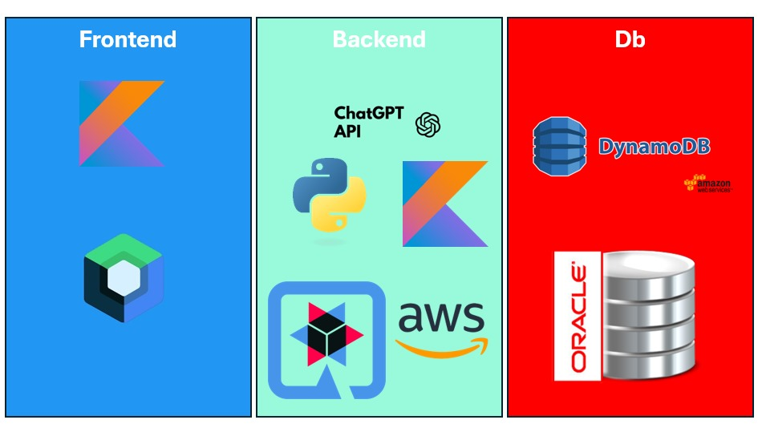

= Pepper for the older ones: Gesichtserkennung und Essensmanagement im Altersheim
Author: Dein Name
:toc:

== Projektbeschreibung

In diesem Projekt wird der Pepper-Roboter verwendet, um die Gesichter der Bewohner eines Altersheims zu erkennen. Der Roboter führt Smalltalk mit den Bewohnern und bietet ihnen Informationen, z.B. über den aktuellen Essensplan. Der gesamte Prozess beinhaltet folgende Schritte:

1. Der Pepper-Roboter nimmt das Gesichtsbild eines Bewohners auf und sendet es an den Amazon Web Service (AWS) zur Gesichtserkennung.
2. AWS verarbeitet das Bild und liefert eine Bewohner-ID zurück, die auf den Bewohner in der lokalen Datenbank verweist.
3. Der Roboter greift anschließend auf die Datenbank zu, um die relevanten Informationen über den Bewohner abzurufen, wie z.B. Name, Zimmernummer, Geburtstag und ob er sich bereits für das Essen angemeldet hat.
4. Falls der Bewohner nicht für das Essen angemeldet ist, fragt Pepper ihn, ob er sich anmelden möchte. Falls der Bewohner dies bestätigt, führt der Roboter die Anmeldung in der Datenbank durch.
5. Zusätzlich greift der Pepper-Roboter auf den Essensplan des Tages zu, um die verfügbaren Gerichte dem Bewohner vorzustellen.
6. Über die Informationen von Personen kann der Pepper weiteren Smalltalk mit der Person führen, um nicht immer wieder ein Gespräch von vorne beginnen zu müssen.

== Entity-Relationship-Diagramm (ERD)

Das folgende ERD zeigt die Beziehung zwischen den Hauptkomponenten des Systems:

[plantuml, format="png"]
----
@startuml
entity DynamoDB {
+Id : int
FaceImage: Bitmap
Name: string
}

entity Chat{
+Text: string
}

entity Senior {
+Id: int
Info: Info
Name: string
Birthday: Date
RoomNumber: int
MealRegistered: boolean
}

entity Info{
+Id: int
Hobbies: string
Interests: string
FamilyTree: Family
}

entity Family{
Children: int
Spouse: string
}

entity MealPlan {
+Selection: Meal
From: Date
Until: Date
}

entity Meal{
+Id: int
}

Chat ||--o{ Senior
Senior ||--o{ MealPlan
MealPlan ||-o{ Meal
Info ||--|| Family
Senior ||--|| Info
Senior ||--|| DynamoDB
@enduml

----

== Use Case Diagram

Das folgende Diagram zeigt das Use-Case-Diagramm des Projektes.

[plantuml, format="png"]
----
@startuml
actor Pfleger
actor Pepper
actor Senior

left to right direction

rectangle "Gesichtserkennung und Datenpflege" {

    usecase "Daten vom Kunden anlegen" as UC6
    usecase "Gesichtserkennung" as UC4
    usecase "Fotos aufnehmen" as UC7
}

rectangle "Interaktionen" {
    usecase "Selbstständige Bewegung\nzu einem Ziel" as UC3
    usecase "Kontaktaufnahme" as UC1
    usecase "Selbst vorstellen" as UC2
}

rectangle "Essenssystem" {
    usecase "Essensplan anzeigen" as UC9
    usecase "Essen bestellen" as UC8
    usecase "Auswahl bestätigen" as UC10
}

Pepper ---- UC1
Pepper ---- UC2
Pepper ---- UC3

Pepper ---- UC4
Pfleger ---- UC6
Pfleger ---- UC7

Pepper ---- UC9
Pepper ---- UC10
Senior ---- UC8

@enduml

----

== Systemarchitektur
